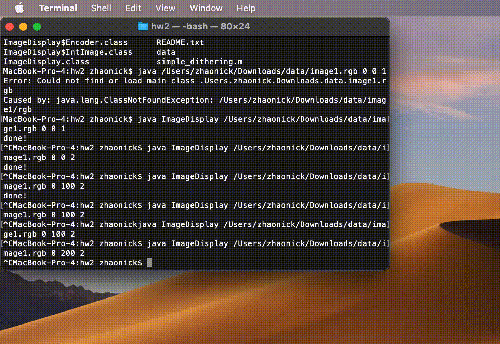

## HW2 Compression, DCT, and Successive Transmission

# Compile
`javac ImageDisplay.java`

# Run
`java ImageDisplay <pathToRGBVideo> <quantizationLevel> <Latency> <DeliveryMode>`
- `quantizationLevel`: 0 <= integer <= 7; controls how much to quantize each channel; 7 means maximum quantization and compression.
- `Latency`: A variable in milliseconds, which will give a suggestive “sleep” time between data blocks during decoding. This parameter will be used to “simulate” decoding as data arrives across low and high band width communication networks.
- `DeliveryMode`: An index ranging from 1, 2, 3. A 1 implies baseline delivery, a 2 implies progressive delivery using spectral selection, a 3 implies progressive delivery using successive bit approximation.
